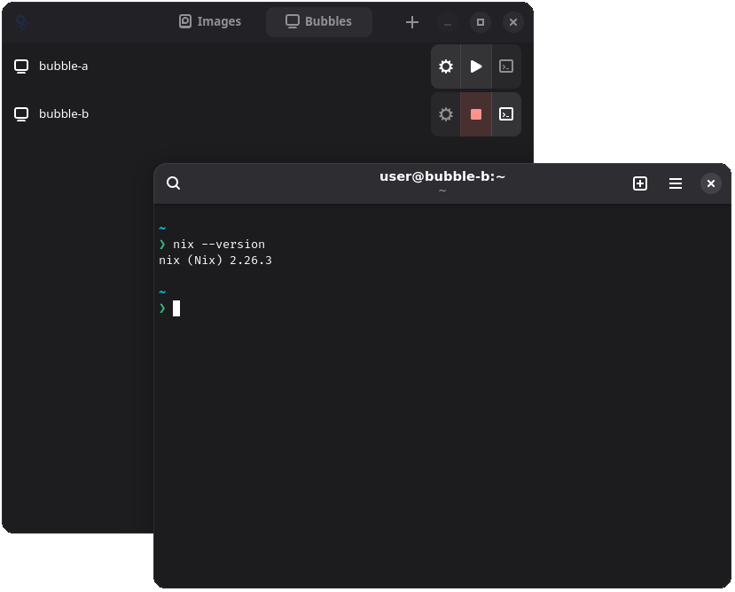
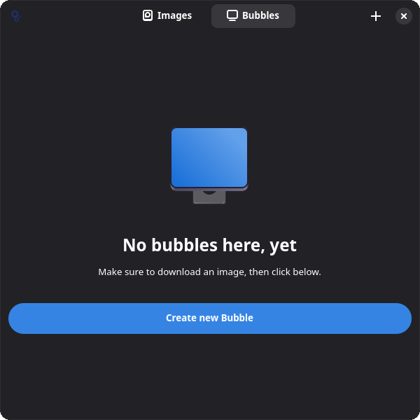
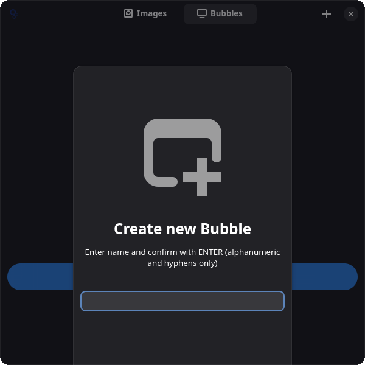
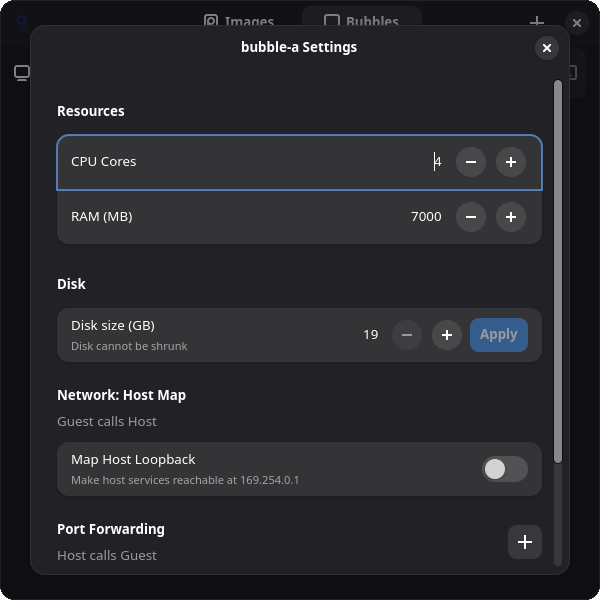

# Bubbles - lightweight Linux working environments

**Quick, yet Full-featured**:

  - Starts an instance in just a few seconds
  - Access to a real Debian installation

**Persistent, yet Disposable**:

  - Run long-living environments: Separate distinct contexts persistently, while not cluttering your host
  - Run quick experiments: Do not break your host, break your Bubble and discard it

**Integrated, yet Isolated**:

  - Wayland windows are managed on the host compositor, Networking is transparent
  - Using sub-sandboxing plus strong KVM isolation boundary

**Powerful, yet Unprivileged**:

  - Run containers effortlessly within a Bubble
  - Bubbles runs as sandboxed, least-privilege Flatpak on any modern Linux (Opinionated distributions like Fedora Atomic and NixOS included)

**Immutable, yet Mutable**:

  - Includes Nix to enable version-controlled, reproducible work environments
  - If Nix is too strict, fall back on Debian's apt or install any other package manager



<details>
<summary>Screenshots</summary>





</details>

## Getting started

Download the flatpak file for the latest `app-v*` release from [releases](https://github.com/gonicus/bubbles/releases).

Install it:

```
flatpak install --bundle $HOME/Downloads/de.gonicus.bubbles.flatpak
```

### Run

Start "Bubbles" via desktop, then:

1. Press image download button, await completion
2. Press VM creation button, enter name, confirm
3. Start VM, await startup and initial setup
4. Press Terminal button
5. Enjoy mutable Debian+Nix Installation
6. (Optional, yet recommended: Setup Nix home-manager, see "Cheat Sheet")

The installed system is a Debian Trixie with preinstalled...
- Gnome Console (kgx)
- Nix 
- sommelier
- starship (configured for nerdfonts)
- bubbles-agent (simple agent for serving needs of the UI)
- FiraCode NerdFont

### Cheat sheet

#### Quick bubble creation

Not a requirement, but using btrfs does seem to apply CopyOnWrite to disk images, so Bubble creation is quicker.

#### Install home-manager (recommended, it's worth it)

```
$ /opt/home-manager-bootstrap init
$ /opt/home-manager-bootstrap switch
# Home Manager is initialized!
$ vim ~/.config/home-manager/home.nix # Add packages from nixpkgs
$ home-manager switch
```

#### Change default terminal

- `sudo update-alternatives --config x-terminal-emulator`

#### Enforcing Wayland

- Chromium: `chromium --ozone-platform=wayland`
- VS Code: `code --ozone-platform=wayland`

## Comparisons

<details>
<summary>Compared to distroboxes...</summary>

Pro Bubbles:
- allows straight-forward use of containers
- provides isolation

Contra Bubbles:
- not as host-integrated as distroboxes

</details>


<details>
<summary>Compared to devcontainers...</summary>

Pro Bubbles:
- allows straight-forward use of containers (hence also devcontainers)

Contra Bubbles:
- not part of devcontainer ecosystem

</details>

<details>
<summary>Compared to allround VM solutions like Gnome Boxes...</summary>

Pro Bubbles:
- does not require stepping through OS installers
- opinionated networking etc.
- allows Wayland integration

Contra Bubbles:
- does not support traditional VM handling use cases

</details>

## Using the work in...

- crosvm + sommelier
- Relm4
- rust-gtk4
- passt
- distrobuilder
- Gnome Console
- ...
